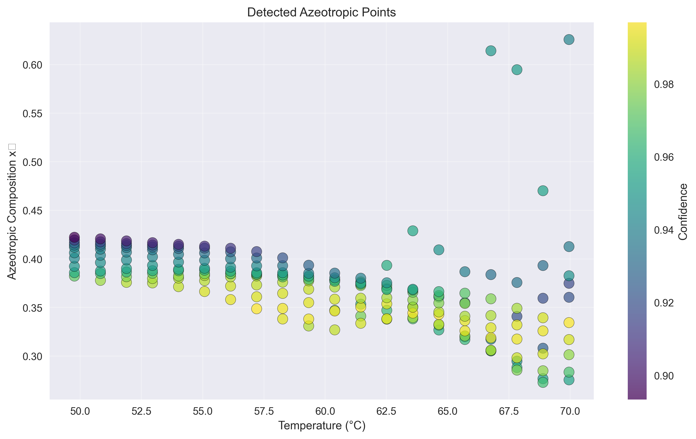
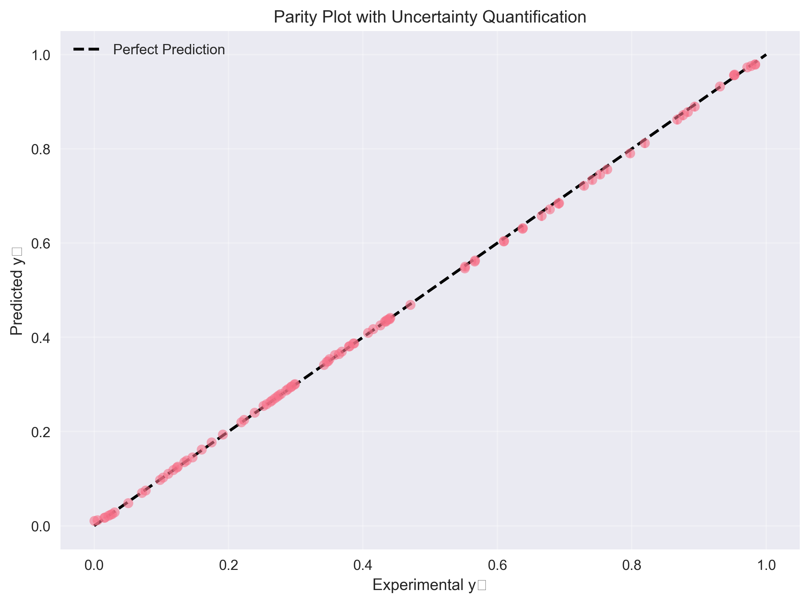
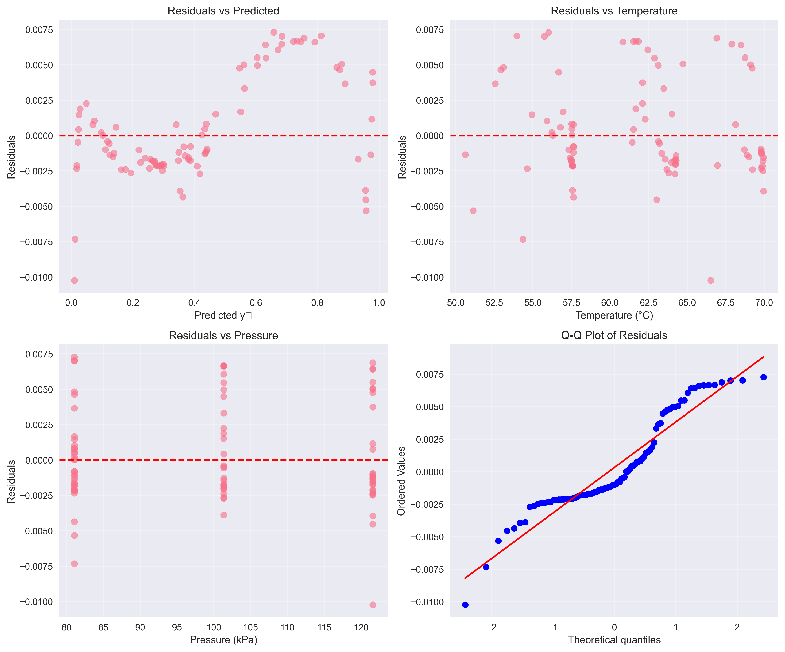
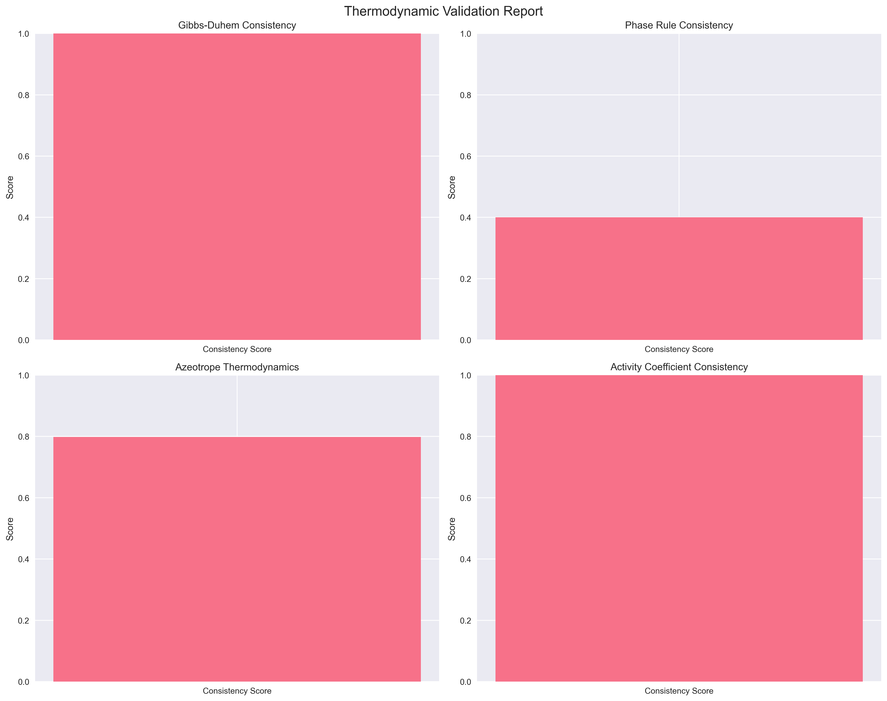
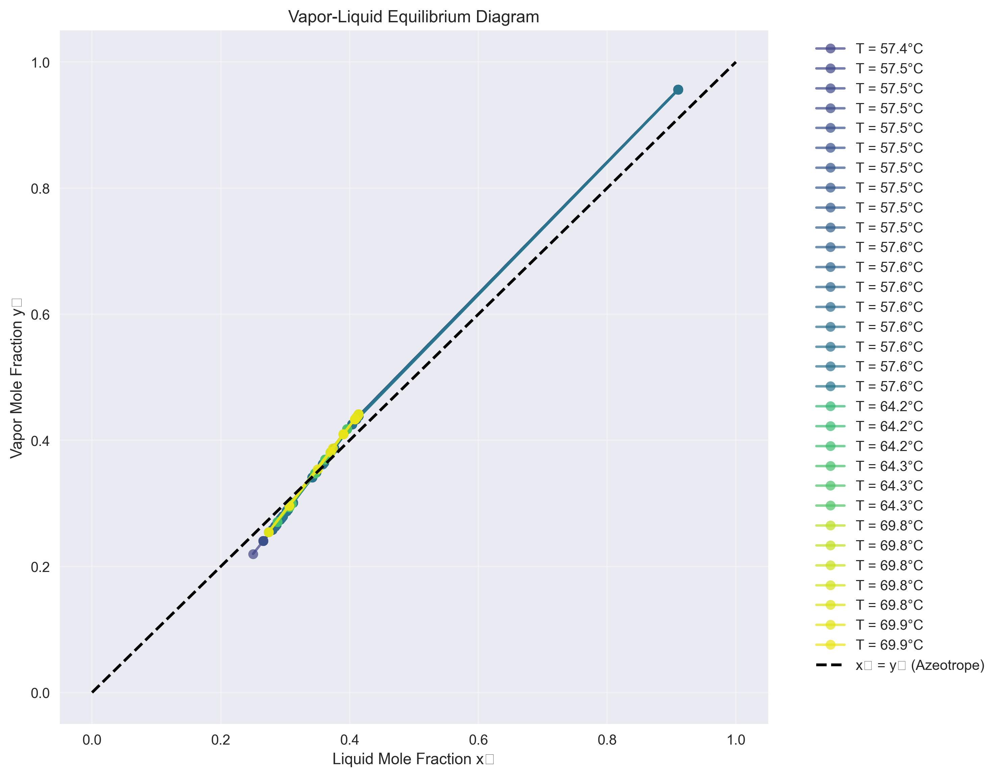

## ANN Surrogate Modeling for Binary Azeotropic VLE

This repository implements an artificial neural network (ANN) surrogate model to predict vapor composition (y1) in binary azeotropic vapor-liquid equilibrium (VLE) systems from liquid composition (x1), temperature (T), and pressure (P). The code includes baseline Raoult's Law comparisons, azeotrope detection, uncertainty quantification, thermodynamic consistency checks, and a Streamlit app for interactive use.

---

## Table of contents

- Overview
- Quickstart (install & run)
- Command-line usage
- Streamlit web app
- Reproduce results (how we generated the plots in /outputs)
- Files in this repo
- Results (figures and explanation)
- How to push this repo to GitHub
- License & notes

---

## Overview

The model predicts vapor mole fraction y1 given x1, T and P. Key features:

- Trains a PyTorch ANN surrogate model with custom scaling.
- Compares predictions to Raoult's Law baseline.
- Detects azeotropic points and exports a scan (`enhanced_azeotrope_scan.csv`).
- Produces diagnostic plots: parity, residuals, VLE diagrams, thermodynamic validation.
- Provides a Streamlit UI for interactive inference.

This project was developed to accelerate VLE calculations and to provide a compact surrogate that can replace expensive iterative thermodynamic calculations in workflows.

---

## Quickstart (Windows / PowerShell)

1) Create and activate a virtual environment (PowerShell):

```powershell
python -m venv .venv
. .venv\Scripts\Activate.ps1
pip install -r requirements.txt
```

2) Run the main training / evaluation script (example):

```powershell
# Replace the excel path and system name with your dataset
python ann_binary_vle_enhanced.py --excel "dataset.xlsx" --system acetone-chloroform --epochs 500 --outdir outputs
```

Notes:
- Use `--sheet SHEETNAME` for multi-sheet Excel files.
- For custom Antoine coefficients supply `--antoine1 A,B,C --antoine2 A,B,C` (units: mmHg and °C input for coefficients as implemented).

---

## Streamlit web app

To run the interactive app locally:

```powershell
python -m streamlit run streamlit_app.py
```

Open the printed localhost URL in your browser (usually http://localhost:8501).

---

## Reproduce the provided results

The `outputs/` folder already contains example results produced by a completed run. To reproduce these figures locally:

1. Ensure you have the same dataset used to generate the outputs (Excel file with columns `x1`, `T`, `P`, `y1`).
2. Run the training/evaluation command shown in Quickstart and supply `--outdir outputs` (or the folder you prefer).
3. After the run completes, check the output folder for the same files listed below.

If you want to re-generate only plots from saved predictions (CSV/JSON), open `ann_binary_vle_enhanced.py` and find the plotting/export routines — they will read from the outputs and save the images.

---

## Files in this repository

- `ann_binary_vle_enhanced.py` — Main training/evaluation script (ANN + evaluation + plotting).
- `streamlit_app.py` — Streamlit UI for interactive inference.
- `thermodynamic_validation.py` — Thermodynamic consistency checks and utilities.
- `requirements.txt` — Python dependencies.
- `outputs/` — Example outputs (figures and CSV/JSON) included with this repo.

Included example outputs (already present in `outputs/`):
- `azeotrope_detection.png`
- `parity_with_uncertainty.png`
- `residual_analysis.png`
- `thermodynamic_validation.png`
- `vle_diagram.png`
- `enhanced_azeotrope_scan.csv`
- `enhanced_results.json`

---

## Results (figures)

Below are the key diagnostic plots produced by the project. These images are referenced from the `outputs/` folder so they will render on GitHub as long as the `outputs/` directory is committed to the repository.

### Azeotrope detection



This plot shows detected azeotropic points and confidence of detection across the scanned composition/temperature grid.

### Parity plot with uncertainty



The parity plot compares predicted y1 vs measured (or reference) y1. Uncertainty bands indicate model confidence or prediction intervals.

### Residual analysis



Residuals vs predicted and vs features are used to check for bias, heteroscedasticity, or systematic errors.

### Thermodynamic validation



Thermodynamic consistency checks ensure that the ANN predictions obey expected thermodynamic constraints (e.g., activity coefficient trends, stability checks).

### VLE diagram



Vapor–liquid equilibrium phase diagram produced from model predictions and reference calculations.

---

## Numerical results & exports

- `outputs/enhanced_results.json` contains training/validation/test MAE and RMSE metrics and other run metadata.
- `outputs/enhanced_azeotrope_scan.csv` contains detailed azeotrope scanning results (composition, temperature, detection confidence).

You can open these files locally or parse them with pandas to create custom summaries.

---


